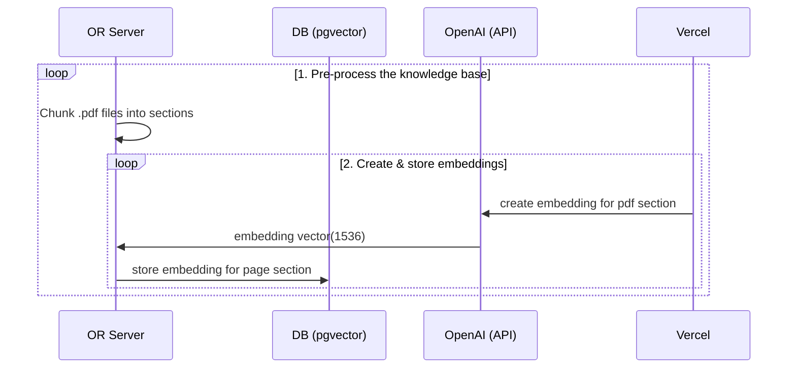

# OpenReview ChatGPT Powered Research Assistant

Building the research assistant involves four steps:

1. Pre-process the accepted submissions of major venues
2. Store embeddings in Postgres with [pgvector](https://supabase.com/docs/guides/database/extensions/pgvector).
3. Perform vector similarity search to find the content that's relevant to the question.
4. Inject content into OpenAI GPT-4 text completion prompt and stream response to the client.

## 👷 Build time

Step 1 and 2 are pre-processing steps that are run asynchronously:



## 🏃 Runtime

Step 3 and 4 happen at runtime, anytime the user submits a question. When this happens, the following sequence of tasks is performed:


### Configuration

- `cp .env.example .env`
- Set your `OPENAI_KEY` in the newly created `.env` file.

### Start the Next.js App

In a new terminal window, run

```bash
pnpm dev
```

## Deploy

Deploy this starter to Vercel. The Supabase integration will automatically set the required environment variables and configure your [Database Schema](./supabase/migrations/20230406025118_init.sql). All you have to do is set your `OPENAI_KEY` and you're ready to go!

[](https://vercel.com/new/clone?demo-title=Next.js%20OpenAI%20Doc%20Search%20Starter&demo-description=Template%20for%20building%20your%20own%20custom%20ChatGPT%20style%20doc%20search%20powered%20by%20Next.js%2C%20OpenAI%2C%20and%20Supabase.&demo-url=https%3A%2F%2Fsupabase.com%2Fdocs&demo-image=%2F%2Fimages.ctfassets.net%2Fe5382hct74si%2F1OntM6THNEUvlUsYy6Bjmf%2F475e39dbc84779538c8ed47c63a37e0e%2Fnextjs_openai_doc_search_og.png&project-name=Next.js%20OpenAI%20Doc%20Search%20Starter&repository-name=nextjs-openai-doc-search-starter&repository-url=https%3A%2F%2Fgithub.com%2Fsupabase-community%2Fnextjs-openai-doc-search%2F&from=github&integration-ids=oac_jUduyjQgOyzev1fjrW83NYOv&env=OPENAI_KEY&envDescription=Get%20your%20OpenAI%20API%20key%3A&envLink=https%3A%2F%2Fplatform.openai.com%2Faccount%2Fapi-keys&teamCreateStatus=hidden&external-id=nextjs-open-ai-doc-search)

## Resources

- Read the blogpost on how we built [ChatGPT for the Supabase Docs](https://supabase.com/blog/chatgpt-supabase-docs).
- [[Docs] pgvector: Embeddings and vector similarity](https://supabase.com/docs/guides/database/extensions/pgvector)
- Watch [Greg's](https://twitter.com/ggrdson) "How I built this" [video](https://youtu.be/Yhtjd7yGGGA) on the [Rabbit Hole Syndrome YouTube Channel](https://www.youtube.com/@RabbitHoleSyndrome):

[](https://www.youtube.com/watch?v=Yhtjd7yGGGA)
