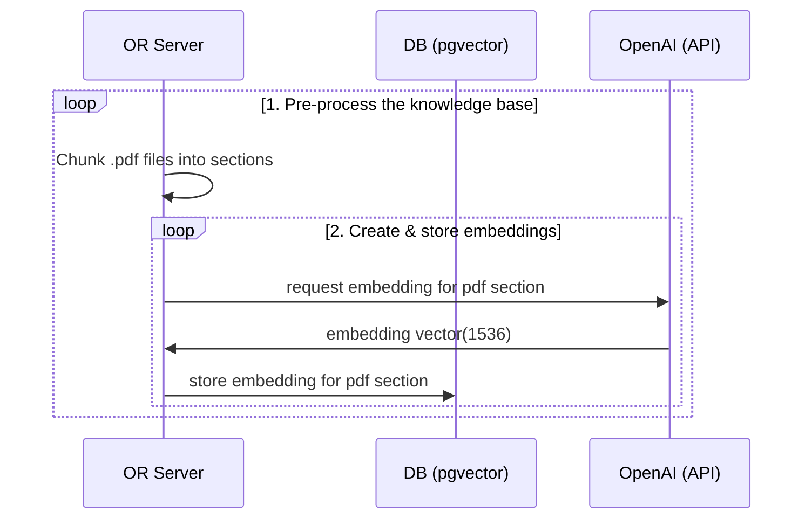
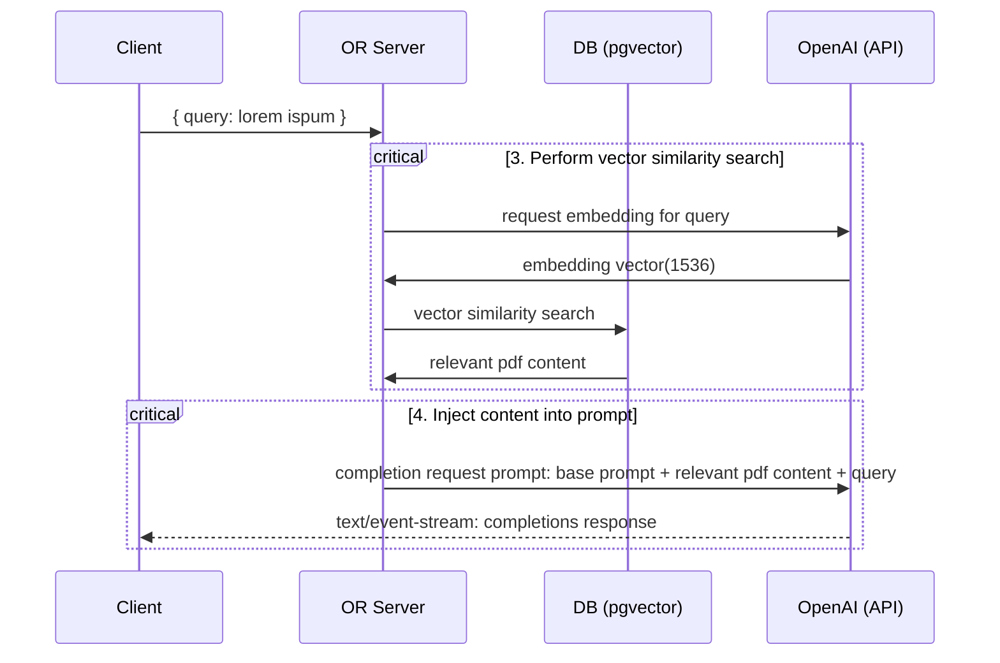

# OpenReview ChatGPT Powered Research Assistant

Building the research assistant involves four steps:

1. Pre-process the accepted submissions of major venues
2. Store embeddings in Postgres with [pgvector](https://supabase.com/docs/guides/database/extensions/pgvector).
3. Perform vector similarity search to find the content that's relevant to the question.
4. Inject content into OpenAI GPT-4 text completion prompt and stream response to the client.

## Build time

Step 1 and 2 are pre-processing steps that are run asynchronously:

## Runtime

Step 3 and 4 happen at runtime, anytime the user submits a question. When this happens, the following sequence of tasks is performed:

